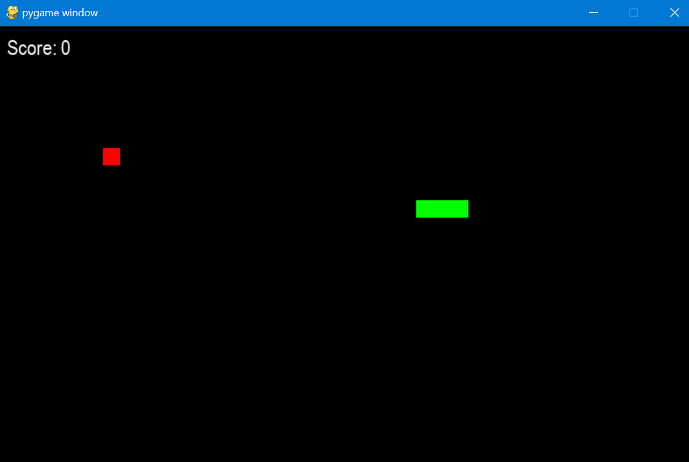

# Hungry Snake Game

A classic arcade-style game built with Pygame. In this game, players control a snake that grows longer by eating food while avoiding collisions with walls and itself. The game is designed to be simple and fun, making it an excellent project for learning game development basics in Python.

## Screenshot for reference



## Features

- Simple and intuitive controls
- Dynamic scoring system
- Game-over state with restart option
- Classic snake game mechanics

## Requirements

- Python 3.x
- Pygame library

## Installation

1. Clone the repository:
   ```bash
   git clone https://github.com/yourusername/HungrySnakeGame.git
   cd HungrySnakeGame
   Install Pygame if you haven't already:
   bash
   Copy code
   pip install pygame
   How to Play
   Run the game:
   ```

bash
Copy code
python snake_game.py
Use the arrow keys to control the snake:

Up: Move Up
Down: Move Down
Left: Move Left
Right: Move Right
Eat the red food to grow the snake and increase your score.

Avoid colliding with the walls or the snake itself.

Press the Space bar to restart the game after a game-over.

## Contributing

Contributions are welcome! If you have suggestions or improvements, feel free to open an issue or submit a pull request.

## Acknowledgments

Inspired by the classic Snake game.
Built with Pygame, a powerful library for game development in Python.
